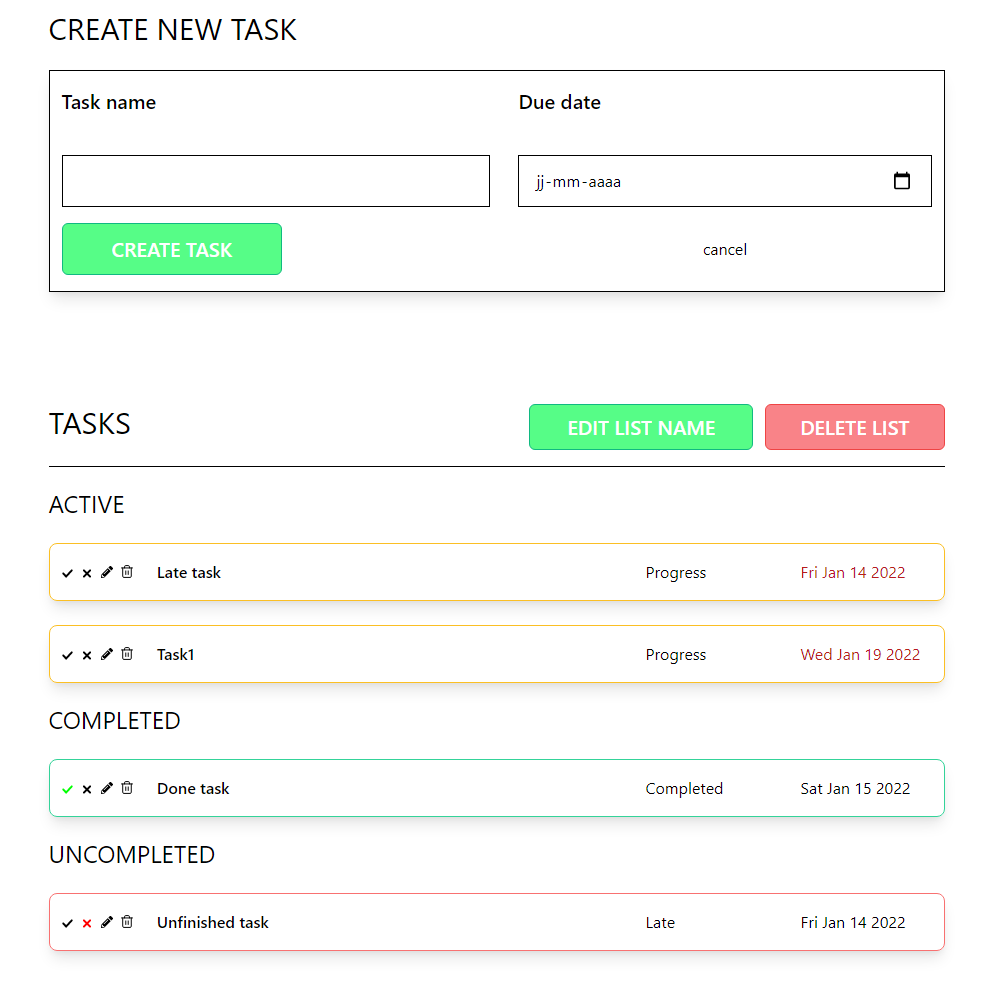

# Tasky
Task organizer project. It consists of a todo list, calendar, and task managmùent. Built using NodeJs, express, ReactJs, and MySQL (for the moment).

## Installation
1. Clone this repo
2. Open 2 terminal window inside the repo
3. Copy in one of the terminals:
```
cd ./server
npm install
nodemon ./server.js
```
4. Copy to the other terminal window:
```
cd ./todo-list
npm install
npm run start
```
or to build the project
```
npm run build
serve -s build
```

## Todo List 


Up comming: 
- [ ] SSL connections between the server and the front-end 
- [ ] Database ecnryption

To access the todo list the user must have an account. The app offers the possibility to create lists and add tasks for every list. As well as manage the tasks by changing the state, editing the task's name or date, or deleting the task. 

## Calendar
Comming soon ...